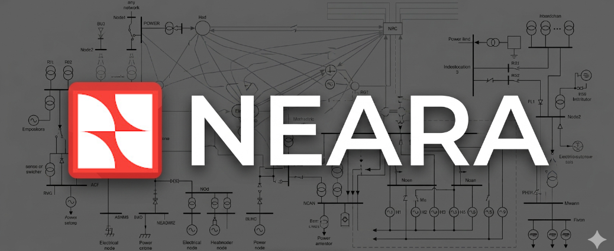

<p align="center">

</p>

# 02 Implementation Guide: The Physics-to-Finance Workflow

## Preparing the Neara Environment & Object Workflow

Before implementing the physics-based logic, you must establish a secure workspace and understand the fundamental relationship between data and objects within the Neara environment.

### Workspace Setup & Privacy

To begin the pilot, initialize your project environment with the following steps:

1. **Initialize the Design:** Open the provided project link and immediately click the **"Make a Copy"** button in the top yellow ribbon to create your private instance.
2. **Ensure Data Privacy:** Navigate to **Project > Share**. Under the "Users and Teams" section, change the **Access Level** to **None**. This ensures your analysis and ROI calculations remain restricted to authorized personnel.
3. **Navigation Tips:** If assets are not visible on the map, press **'F'** to fit the view to the project extent. In the data tables, clicking the **crosshair icon** next to an asset will automatically zoom the map to that specific physical location.

### Understanding the Object-Oriented Interface

In Neara reports, you are primarily interacting with **collections of objects**. Whether you are looking at the **Asset List** a data table listed in the schema as dt_asset_list or the Poles object collection. When visualized as a table remember: **each row is an individual object.**

When you define a field for a table object, you are actually defining a function that runs for every object (row) in that collection.

### Opening your Data Table collections

1. **Click on the "Data Tables" tab.** In the upper left hand side of your work envionment.
2. **Click on the "New" button.** Follow the menu instructions to load the data we prepared manually from you asset management system found in the /data folder.
3. **Open the table for viewing.** Double clicking on it in the table listing to the left and then click the "View dta Table as report" button. Then drag the report to the bottom of the work envionment to dock it in the tray with the other data sets.
4. **Repeat this proces** for every data file in the /data folder of this pilot documentation package.

### How to Create Custom Fields

To add a new layer of logic to your data tables or model objects:

1. **Open the Data Table:** Navigate to the report you wish to modify (e.g., `dt_asset_list`).
2. **Add a Field:** Click the **"+" button** located on the far right side of the data table.
3. **Define the Field:** A combo box will appear. You can select existing fields or type a unique name (e.g., `u_fk_cost_of_mitigation`) to create a new one.
4. **Schema & Equation:** * **Description:** Enter documentation explaining the purpose of the field. This is critical for future audits and team handoffs.
* **Equation:** Enter the logic for the calculation.

> [!NOTE]
> **The "Self" Perspective:** When writing equations, you are referencing values on the row object itself. Entering `pole_type & "-" & zone` is functionally identical to entering `self.pole_type & "-" & self.zone`. As you progress to more complex functions, the relationship will typically follow the pattern: **Current Row Object -> Collection of Other Objects.**

### The Engineering Philosophy: Sustainability & KISS

Grid-scale implementations require sustainable logic. While the Neara engine can handle massive, nested functions, we follow the **KISS (Keep It Simple Smartie)** principle.

* **Decompose:** If you are about to write a "grand unifying function," don't. Break it into small, manageable fields.
* **Reuse:** Create small "helper" fields and reference them in your final calculation.
* **Declutter:** You do not have to display every field you create. By decomposing logic into hidden fields, you keep the report clean for stakeholders while ensuring the math is easy to verify and maintain.

---

## Stage 1: Financial Parameter Mapping

Now we map the financial we calculated and extracted from the asset management system into variables. 

### 1. Create an Mitigation Key(`u_mitigation_key`) on the Cost of Mitigation(`dt_cost_of_mitigation`) data table

**Description:** This field is a unique reference to a unique object in the `dt_cost_of_mitigation` table to allow for easy data import with a find function. **Warning** if this field is not unique analysis results may be corrupted.

* **Data Type:** `Text`
* ** Field Equation:**

```javascript
pole_type & "-" & zone

```
### 2. Create a Cost of Mitigation Foreign Key (`u_fk_cost_of_mitigation`) on the Asset List(`dt_asset_list`) data table

**Description:** A foreign key linking to `dt_cost_of_mitigation.u_mitigation_key` used to find the cost of replacing a specific pole type in a specific area in `dt_asset_list.u_pole_mitigation_cost`. This references values on the row object itself (`self.pole_type & "-" & self.zone`).

* **Data Type:** `Text`
* **Equation:**

```javascript
pole_type & "-" & zone

```
### 3. Import the Pole Mitigation Cost (`u_pole_mitigation_cost`) from the Cost of Mitigation(`dt_cost_of_mitigation`) data table to the Asset List(`dt_asset_list`) data table

**Description:** This field indicates the cost of replacing this pole with a new one. Each Asset List(`dt_asset_list`) object finds a Cost of Mitigation(`dt_cost_of_mitigation`) object with matching keys and reference cost of mitigation. .

* **Data Type:** `Price ($)`
* **Equation:**

```javascript
find(
  Model().dt_cost_of_mitigation[].cost_of_mitigation,
  Model().dt_cost_of_mitigation[].u_mitigation_key = u_fk_cost_of_mitigation
)

```
> [!NOTE]
> **The "Decompose" and "Reuse" Perspective:** We could have written the above function as follows instead of as 3 different functions over 3 fields: `find(Model().dt_cost_of_mitigation[].cost_of_mitigation, (Model().dt_cost_of_mitigation[].pole_type & "-" & Model().dt_cost_of_mitigation[].zone) = (pole_type & "-" & zone) )`. By decomposing you make the logic more simple and readable. Second, you expose the data type of the check. This allows you not only to find the proper functions in the documentation but prevent side effects. Finally it allows you to debug each side of the checks values separately to validate your field development approach.**

### 4. Import the Intervention Reduction Effect (`u_intervention_reduction_effect`) from the Intervention Effect (`dt_intervention_effect`) data table

**Description:** The proportional reduction in risk of failure achieved by replacing a pole in a specific zone. This variable represents the efficacy of the mitigation strategy based on environmental factors.

* **Data Type:** `Dimensionless`
* **Equation:**

```javascript
find(
  Model().dt_intervention_effect[].proportional_reduction_in_probability_of_failure, 
  Model().dt_intervention_effect[].zone = self.zone
)

```

### 5. Calculate the Gross Cost Avoidance (`u_cost_avoidance`)

**Description:** The total expected financial risk removed from the grid for each pole replacement. This is a primary ROI metric derived by multiplying the Probability of Failure (PoF), the Consequence of Failure (USD), and the Intervention Efficacy (Reduction Effect).

* **Data Type:** `Price ($)`
* **Equation:**

```javascript
probability_of_failure * consequence_of_failure_usd * u_intervention_reduction_effect

```

### 6. Calculate the Net Cost Avoidance (`u_net_cost_avoidance`)

**Description:** The final ROI delta for the intervention. By subtracting the actual cost of mitigation from the gross cost avoided, we determine the net enterprise value created by replacing the asset. This field is used to prioritize replacements based on the highest financial yield.

* **Data Type:** `Price ($)`
* **Equation:**

```javascript
u_cost_avoidance - u_pole_mitigation_cost

```

> [!NOTE]
> **Order of Operations:** Note that `u_net_cost_avoidance` (Step 6) reuses the results from `u_cost_avoidance` (Step 5), which in turn relies on the imported value in `u_intervention_reduction_effect` (Step 4). By building these as separate fields, you can verify the "Risk Buy-Down" at each stage of the calculation, ensuring that the final ROI figures are structurally sound and auditable.

---

## Stage 2: Physics Modeling & GIS Integration

In this stage, we transition from static financial tables we imported from our assets system to the dynamic physical model. We will calculate the environmental risk factors of the spans, aggregate those risks to the connecting poles, and finally link our physical model to the GIS inventory records allowing us in stage 3 to link risks from the model to assets in our physical calculation.

### Activity 1: Physical Modeling of Spans (Cascading Risk)

The physical relationship between spans is a critical risk factor. A span failing above another creates a cascading failure scenario, increasing the cost to remediate that asset.

#### 1. Identify Overlapping Spans (`u_spans_below`) on the Span model object

**Description:** Determines the number of spans physically located directly beneath the current span. This identifies assets whose failure would result in secondary damage to lower-voltage lines or infrastructure.

* **Data Type:** `Integer`
* **Equation:**

```javascript
len(
  find_crossing_spans_below(self)
)

```

#### 2. Apply Consequence Modifiers (`u_lower_span_cost_modifier`) on the Span Object

**Description:** Maps the number of overlapping spans to a specific financial modifier from the `dt_task_2_consequence_modifier` table.

* **Data Type:** `Dimensionless`
* **Equation:**

```javascript
find(
  Model().dt_task_2_consequence_modifier[].consequence_cost_modifier,
  u_spans_below & "" = Model().dt_task_2_consequence_modifier[].number_of_span_overlaps
)

```

---

### Activity 2: Imputing Span Risk to Connecting Poles

Once the risk of a span is calculated, that risk must be attributed to the poles that support it. Since every span is supported by two poles (Pole 1 and Pole 2), we use helper fields to check the connectivity on both ends.

#### 1. Connectivity Helper: Pole 1 Modifier (`u_pole1_cost_modifier`)

**Description:** Checks if the current pole is acting as "Pole 1" for any span with a lower span cost modifier.

* **Data Type:** `Dimensionless`
* **Equation:**

```javascript
find(
  Model().Spans[].u_lower_span_cost_modifier,
  Model().Spans[].pole1[].label = self.label
)

```

#### 2. Connectivity Helper: Pole 2 Modifier (`u_pole2_cost_modifier`)

**Description:** Checks if the current pole is acting as "Pole 2" for any span with a lower span cost modifier.

* **Data Type:** `Dimensionless`
* **Equation:**

```javascript
find(
  Model().Spans[].u_lower_span_cost_modifier,
  Model().Spans[].pole2[].label = self.label
)

```

#### 3. Total Pole Consequence Modifier (`u_lower_span_cost_modifier`)

**Description:** The sum of modifiers from all connected spans. This provides the total resilience impact of the pole based on its network connectivity.

* **Data Type:** `Dimensionless`
* **Equation:**

```javascript
u_pole1_cost_modifier + u_pole2_cost_modifier

```

> [!NOTE]
> **Addition of None:** Again we see the implementation of two fields step 1 and step 2 in order to implement step 3. Normally a pole will be attached to two spans but minimally it has to be attached to one span unless it is a stay or something. We are using addition to add the span cost impact. Since in Neara None + 1 = 1 we can easily aggrigate the span risk.


---

### Activity 3: GIS Integration & Asset Mapping

The final task is to bridge the gap between the 3D physics model and the GIS inventory data (`dt_task_2_pole_ids`). This requires disambiguating assets that share the same horizontal coordinates but exist at different elevations.

#### 1. Z-Axis Disambiguation (`u_pole_height_segment`)

**Description:** Because lines are built at different times under different regulations, they often intersect in the X/Y plane. We "bin" poles by height to ensure GIS data is mapped to the correct asset elevation.

* **Data Type:** `Integer`
* **Equation (on Poles):** `round(height / unit("ft"))`
* **Equation (on GIS data -`dt_task_2_pole_ids`):** `round(height)`

#### 2. Find pole candidates (`u_pole_location_canidate`) in the models Poles which are in the right hight segment and import that collection to the  GIS data (`dt_task_2_pole_ids`)

**Description:** Uses a geometric query to find pole location within a specific radius (80ft) GIS data.

* **Data Type:** `List<Coordinate Distance Geometry>`
* **Equation:**

```javascript
filter(
  Model().Poles[].geometry, 
  Model().Poles[].u_pole_height_segment = u_pole_height_segment
)
```

#### 3. Spatial Key Generation (`u_pole_loc_key`) on GIS data (`dt_task_2_pole_ids`)

**Description:** Uses a geometric query to find GIS locations within a specific radius (80ft) that match the height segment.

* **Data Type:** `Point`
* **Equation:**

```javascript
geo_query(
  u_pole_location_canidates,
  self.geometry,
  80 * unit("ft")
)[0]
```
<Stopped here>


#### 4. Importing the GIS Asset Link Id (`dt_task_2_pole_ids.pole_id`) to a field in Poles (`u_pole_id`)

**Description:** The primary key linking the model to the inventory. This uses a proximity check (<5ft) combined with the height segment.

* **Data Type:** `Label`
* **Equation:**

```javascript
find(
  Model().dt_task_2_pole_ids[].pole_id,
  and(
    Model().dt_task_2_pole_ids[].u_pole_height_segment = self.u_pole_height_segment, 
    measure_distance(self.geometry, Model().dt_task_2_pole_ids[].geometry).distance < 5ft
  )
)

```

> [!NOTE]
> **Engineering Note: Reliability & Manual Overrides**
> During the pilot phase, the function measure distance did not return a distance object and therefore although geometries should be ~0ft distance this query returns None. As a result None is < 5ft and this is always true. To disambiguate we will manually inspect in the Perspective viewer. This ensures the ROI analysis remains uninterrupted while the spatial query is refined.

#### 5. Creating Pole Id (`u_manual_pole_id`) in the model objects Poles via manual inspection.
1. Turn on Pole Height Segment by navigating to the Poles object set and clicking on the "eye" icon for that field.
2. Turn on Pole Height Segment by navigating to the GIS data table(`dt_task_2_pole_ids`) object set and clicking on the "eye" icon for that field.
3. Navigate to the Pole Loc Key field. These are just the points from this GIS data but the query shows that there is at least 1 pole within 80ft of all GIS coordinate.
4. Modulate the distance tell you have only one entry in your results set(25ft).
5. Click on the point and you know the closest pole with the same height is the one that belongs to this GIS coordinate.
6. Write down the Poles.label for the pole after clicking on it and then write down the Pole Id.
7. Repeat this process modulating distance on steps 5 & 6 in the perspective tell you have come up with the poll mapping.

**Description:** Manual entry of the dt_task_2_pole_ids.pole_id linking the model to the GIS inventory. 

* **Data Type:** `Text`
* **Equation:**

```javascript
if
(
  self.label = "Pole1", "143",
  self.label = "Pole2", "430",
  self.label = "Pole3", "201",
  self.label = "Pole4", "637",
  self.label = "Pole5", "576",
  self.label = "Pole6", "906",
  self.label = "Pole7", "250",
  self.label = "Pole8", "767",
  ""
)		  
```
---
## Stage 3: Physics-to-Finance Consolidation

In this final stage, we bridge the gap between the 3D physics model and the financial planning table. By importing the "Cascading Risk" modifiers calculated in the model back into the **Asset List** (`dt_asset_list`), we transition from a baseline financial estimate to a "Physics-Informed" ROI analysis. This allows the business to prioritize assets not just by age, but by their actual physical impact on the network.

### 1. Model Linkage Helper (`u_pole_id_text`)

**Description:** To ensure precise data joining between the physics model and the financial table, we transform the `pole_id` from a label/ID type into a text string. This prevents logic errors during the import process and facilitates debugging.

* **Data Type:** `Text` 

* **Equation:**
```javascript
pole_id & ""
```
### 2. Import Physics Modifier (`u_span_mitigation_cost_multiplier`)

**Description:** This field accounts for complex span relationships. When spans connected to poles pass over other spans, the physical consequence and thus the cost of failure increases. This function looks up the specific pole in the model using the `u_manual_pole_id` established in Stage 2 and retrieves its physics-based modifier.

* **Data Type:** `Dimensionless` 

* **Equation:**

```javascript
    find(
      Model().Poles[].u_lower_span_cost_modifier,
      self.u_pole_id_text = Model().Poles[].u_manual_pole_id
    )
```
### 3. Cost Modifier Normalization (`u_span_cost_modifier_normalized`)

**Description:** The physics modifier only joins to a subset of the fields in the Asset List (only those modeled in Stage 2). This field defaults all undefined values to 1.00.

* **Data Type:** `Dimensionless` 
* **Equation:**
```javascript
    if(
      u_span_mitigation_cost_multiplier, 
      u_span_mitigation_cost_multiplier,
      1.00
    )
 ```   
> [!NOTE]
> **Leveraging Truthiness in Neara:  **
> The if statement performs a logical test. The documentation gives this example - if(true, "pass", "fail") returns "pass" but the logical value marked by boolean true here can be replaced with a truthy/falsy statement. IE if there is something it is true else false. This allows us to cleanup the data for the span_mitigation_cost_multiplier.

### 4. Adjusted Mitigation Cost (`u_actual_pole_mitigation_cost`)

**Description:** This represents the "True Cost" of the asset failing. It scales the baseline mitigation cost by the physical risk factor discovered in the model. This accounts for the additional labor and equipment required to repair complex intersections or cascading failures.

* **Data Type:** `Price ($)`
* **Equation:**
```javascript
    u_pole_mitigation_cost * u_span_cost_modifier_normalized
```   

### 5. Physics-Informed Net Cost Avoidance (`u_net_cost_avoidance`)

**Description:** This is the definitive ROI metric for the pilot project. By taking the gross cost avoided (Stage 1, Step 5) and subtracting the **actual** cost of mitigation after physical span relationships are accounted for, we determine the total value to the business for each specific intervention.

* **Data Type:** `Price ($)` 

* **Equation:**
```javascript
u_cost_avoidance - u_actual_pole_mitigation_cost
```
---
## Stage 4: Findings to action

When Neara is fully implemented a client will take their findings and push actions into a workflow system. In this case however we will validate the results by hand. You may download each one of the data tables and its results into a CSV file. You can compare your results to our results found in the results folder. We took the Asset-List-Analysis-Output.csv and then did some basic summation math to calculate what the savings with Neara is over the status quo. We welcome you to use whatever analytic solution you desire to validate our results.

<p align="center">

</p>
*© 2026 Neara. Internal Validation Use Only.*